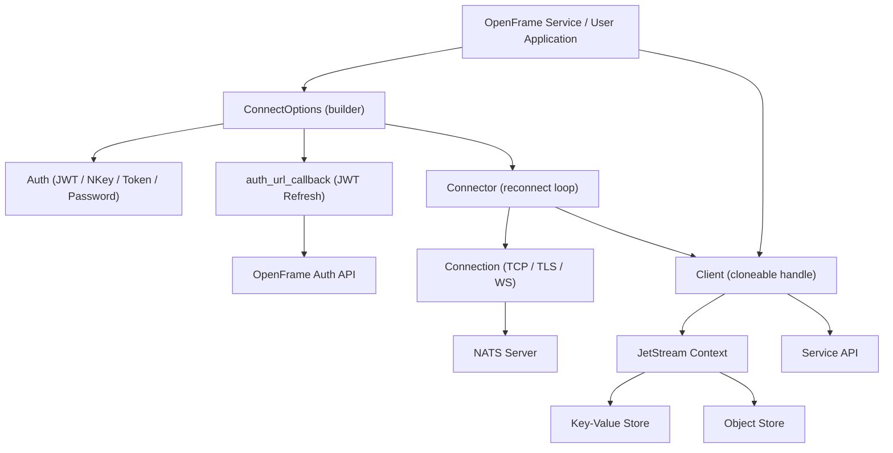

<div align="center">
  <picture>
    <source media="(prefers-color-scheme: dark)" srcset="https://shdrojejslhgnojzkzak.supabase.co/storage/v1/object/public/public/doc-orchestrator/logos/1771371901777-lc3cse-logo-openframe-full-dark-bg.png">
    <source media="(prefers-color-scheme: light)" srcset="https://shdrojejslhgnojzkzak.supabase.co/storage/v1/object/public/public/doc-orchestrator/logos/1771372526604-k3y1w-logo-openframe-full-light-bg.png">
    
  </picture>
</div>

<p align="center">
  <a href="LICENSE.md"></a>
</p>

# nats.rs

> Rust async client for the NATS messaging system — Flamingo-maintained fork with OpenFrame JWT token refresh integration.

`nats.rs` is a Tokio-based asynchronous Rust client for [NATS.io](https://nats.io), built and maintained by [Flamingo](https://flamingo.run). It is a fork of the official NATS Rust client, extended with OpenFrame-specific capabilities — most notably an **automatic JWT token refresh callback mechanism** that enables seamless, uninterrupted connectivity with OpenFrame authentication services.

The primary crate is `async-nats`, which exposes the full NATS feature set through an idiomatic, async-first Rust API built on Tokio. The legacy synchronous `nats` crate is deprecated and no longer actively maintained.

---

## Features

- **Core Pub/Sub** — High-throughput publish and subscribe over NATS subjects with wildcard matching
- **Request / Reply** — Built-in request–reply pattern with configurable timeouts and inbox subjects
- **JetStream** — Persistent messaging with at-least-once and exactly-once delivery semantics
- **Key-Value Store** — NATS-backed KV store with history tracking, TTL, and per-key revision
- **Object Store** — Large binary object storage with chunked upload/download and SHA-256 integrity
- **Service API** — Micro-service framework with discovery (`$SRV.PING`), stats, and lifecycle management
- **TLS / mTLS** — Full mutual TLS support via `rustls` (no OpenSSL dependency), including TLS-first and native cert store
- **Authentication** — JWT, NKey, token, username/password, credentials files, and async auth callbacks
- **OpenFrame JWT Refresh** — Flamingo extension: automatic JWT rotation via `auth_url_callback` on authorization violations
- **WebSocket** — Connections over WebSocket in addition to TCP
- **Cloneable Client** — `Client` is cheaply cloneable via `Arc`-backed internals, safe to share across tasks

---

## Architecture



### OpenFrame JWT Token Refresh

The key Flamingo addition over upstream `nats.rs` is automatic JWT rotation. When the NATS server returns an `Authorization Violation`, the `Connector` transparently invokes `auth_url_callback` to obtain a fresh JWT from the OpenFrame Auth API and reconnects — without surfacing any interruption to subscribers or publishers.

```text
ConnectErrorKind::AuthorizationViolation
  └─► Connector::handle_auth_error()
        └─► calls options.auth_url_callback (async fn() -> Result<String, AuthError>)
              └─► fetches fresh JWT from OpenFrame Auth API
                    └─► updates options.auth.jwt
                          └─► retries connection loop
```

---

## Quick Start

### Prerequisites

| Tool | Minimum Version |
|---|---|
| Rust (stable) | 1.75+ |
| NATS Server | 2.9+ |
| Git | 2.x |

Install the Rust toolchain via [rustup](https://rustup.rs/):

```bash
curl --proto '=https' --tlsv1.2 -sSf https://sh.rustup.rs | sh
```

Install the NATS server:

```bash
# macOS
brew install nats-server

# Linux — adjust version/arch as needed
curl -L https://github.com/nats-io/nats-server/releases/download/v2.10.4/nats-server-v2.10.4-linux-amd64.tar.gz | tar xz
sudo mv nats-server-v2.10.4-linux-amd64/nats-server /usr/local/bin/
```

### Clone and Build

```bash
git clone https://github.com/flamingo-stack/nats.rs.git
cd nats.rs
cargo build --workspace
```

### Add as a Dependency

In your project's `Cargo.toml`:

```toml
[dependencies]
async-nats = "0.33"
tokio = { version = "1", features = ["full"] }
futures-util = "0.3"
bytes = "1"
```

### Hello World

Start a local NATS server with JetStream enabled:

```bash
nats-server -js
```

Connect, publish, and subscribe:

```rust
use bytes::Bytes;
use futures_util::StreamExt;

#[tokio::main]
async fn main() -> Result<(), async_nats::Error> {
    let client = async_nats::connect("nats://localhost:4222").await?;

    let mut subscriber = client.subscribe("hello").await?;

    client.publish("hello", Bytes::from("world")).await?;
    client.flush().await?;

    if let Some(message) = subscriber.next().await {
        println!(
            "Received on '{}': {}",
            message.subject,
            std::str::from_utf8(&message.payload).unwrap_or("<binary>")
        );
    }

    Ok(())
}
```

```bash
cargo run
# Received on 'hello': world
```

### OpenFrame JWT Refresh

```rust
let refresh_token = std::env::var("OF_REFRESH_TOKEN").unwrap();

let client = async_nats::ConnectOptions::new()
    .auth_url_callback(move || {
        let token = refresh_token.clone();
        async move {
            let jwt = fetch_jwt_from_openframe(&token).await?;
            Ok(jwt)
        }
    })
    .connect("nats://my-openframe-server:4222")
    .await?;
```

---

## Technology Stack

| Layer | Technology |
|---|---|
| Async runtime | [Tokio](https://tokio.rs/) |
| TLS | `rustls` / `tokio-rustls` (no OpenSSL) |
| Serialisation | `serde` / `serde_json` |
| Authentication | `nkeys` (Ed25519), `ring` / `aws-lc-rs` (SHA-256) |
| Buffer management | `bytes` (zero-copy `Bytes` / `BytesMut`) |
| Error handling | `thiserror` |
| Tracing | `tracing` |
| Transport | TCP, TLS, WebSocket (`tokio-websockets`) |

### Feature Flags

| Flag | Effect |
|---|---|
| `ring` (default) | SHA-256 via the `ring` crate |
| `aws-lc-rs` | SHA-256 via AWS LC (FIPS-compatible) |
| `websockets` | Enable WebSocket transport |
| `server_2_10` | NATS Server 2.10+ features (KV compression, stream compression) |
| `server_2_11` | NATS Server 2.11+ features (per-key TTL, consumer pause) |
| `service` | NATS Service API (`$SRV` prefix) |

---

## Running Tests

Tests require a `nats-server` binary on your `$PATH`. The test helper crate automatically manages server lifecycle:

```bash
# Full test suite
cargo test --manifest-path async-nats/Cargo.toml

# With server_2_10 features
cargo test --manifest-path async-nats/Cargo.toml --features server_2_10

# With debug logging
RUST_LOG=async_nats=debug cargo test --manifest-path async-nats/Cargo.toml -- --nocapture
```

---

## Repository Structure

```text
nats.rs/
├── async-nats/          # Primary async client (Tokio-based) — active development
│   ├── src/             # Library source
│   ├── examples/        # Runnable examples
│   ├── tests/           # Integration tests
│   └── benches/         # Benchmarks
├── nats/                # Legacy synchronous client (deprecated)
└── nats-server/         # Test helper crate
```

---

## Documentation

📚 See the [Documentation](./docs/README.md) for comprehensive guides covering architecture, getting started, development workflows, and security.

---

## Community

Flamingo does not use GitHub Issues or Discussions. All support, questions, and community conversation happen on the **OpenMSP Slack**:

- Join at [https://www.openmsp.ai/](https://www.openmsp.ai/)
- Invite: [https://join.slack.com/t/openmsp/shared_invite/zt-36bl7mx0h-3~U2nFH6nqHqoTPXMaHEHA](https://join.slack.com/t/openmsp/shared_invite/zt-36bl7mx0h-3~U2nFH6nqHqoTPXMaHEHA)

For code changes, open a pull request directly at [https://github.com/flamingo-stack/nats.rs](https://github.com/flamingo-stack/nats.rs).

---

<div align="center">
  Built with 💛 by the <a href="https://www.flamingo.run/about"><b>Flamingo</b></a> team
</div>
