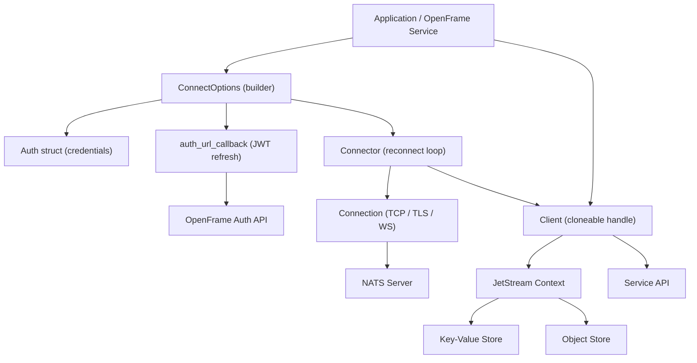
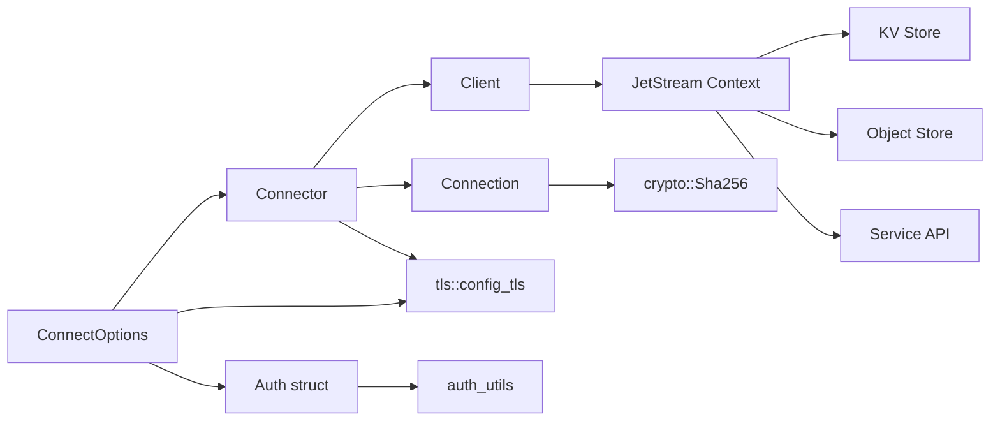
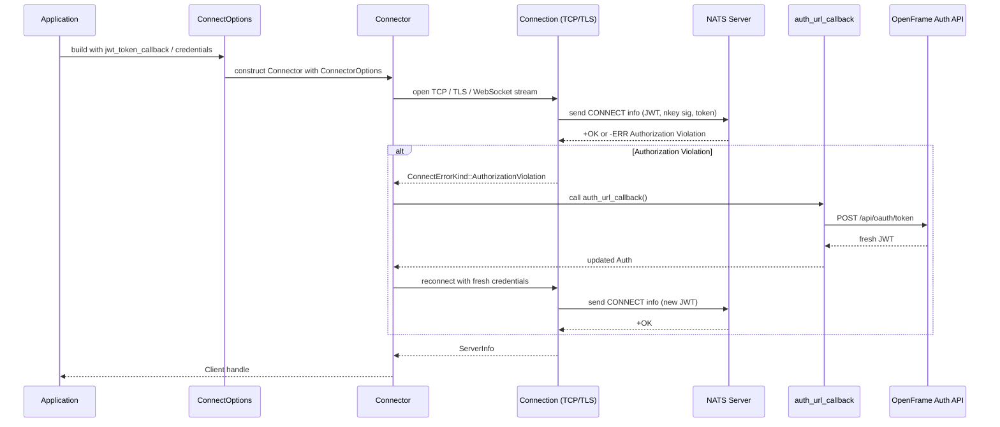
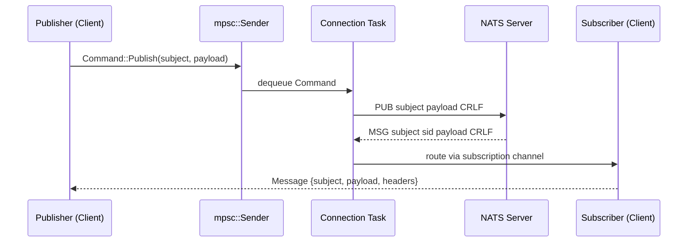
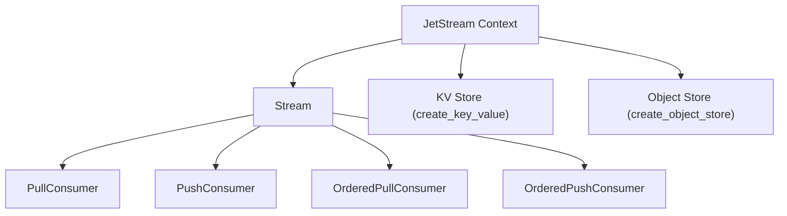

# Architecture Overview

This document describes the high-level architecture of the `async-nats` crate — the primary Rust async client for NATS in this repository.

For detailed module-level documentation, see the [reference architecture docs](../../reference/architecture/overview.md).

---

## Design Goals

- **Async-first:** Built on [Tokio](https://tokio.rs/), every operation is non-blocking.
- **Cloneable client handle:** `Client` is cheaply cloneable via `Arc`-backed internals, safe to share across tasks without wrapping in a `Mutex`.
- **Layered API surface:** Core pub/sub is simple; JetStream, KV, Object Store, and the Service API are all built on top.
- **OpenFrame JWT integration:** The `Connector` handles automatic JWT refresh via `auth_url_callback` on authorization failures.

---

## High-Level System Design

---

## Core Components

| Module | File | Responsibility |
|---|---|---|
| `ConnectOptions` | `src/options.rs` | Builder for all connection config: TLS, auth, timeouts, callbacks |
| `Client` | `src/client.rs` | Cloneable pub/sub/request handle; wraps channels to connection task |
| `Connector` | `src/connector.rs` | Server list management, reconnect loop, auth error recovery, JWT refresh |
| `Connection` | `src/connection.rs` | Framed async TCP/TLS/WebSocket I/O; NATS protocol parser |
| `Auth` | `src/auth.rs` | Credential container: JWT, nkey, signature callback, username/password, token |
| `auth_utils` | `src/auth_utils.rs` | `.creds` file parser: regex-based JWT and nkey seed extraction |
| `tls` | `src/tls.rs` | `rustls::ClientConfig` builder; native certs, user certs, mTLS |
| `Message` | `src/message.rs` | Core message struct: subject, reply, payload, headers, status |
| `Subject` | `src/subject.rs` | UTF-8–validated, immutable subject string type |
| `HeaderMap` | `src/header.rs` | NATS message headers: insert, append, get, iterate |
| `StatusCode` | `src/status.rs` | NATS numeric status codes (100–999) with semantic helpers |
| `Error<Kind>` | `src/error.rs` | Generic typed error with optional source chaining |
| `jetstream/` | `src/jetstream/` | Streams, consumers (push/pull/ordered), KV, Object Store, Service API |

---

## Component Relationships

---

## Data Flow

### Connection Establishment and JWT Token Refresh

This is the Flamingo-specific extension on top of upstream NATS: when the server returns an `Authorization Violation` error, the `Connector` invokes `auth_url_callback` to obtain a fresh JWT from the OpenFrame Auth API and reconnects automatically.

### Publish / Subscribe Message Flow

---

## JetStream Subsystem

JetStream is built on top of the core `Client` and adds persistence, replay, consumers, and higher-level stores. The `jetstream::Context` is the entry point.

---

## Key Design Decisions

1. **Channels over locks:** `Client` communicates with the background `Connection` task via `mpsc` channels rather than shared-mutable state. This avoids locks on the hot publish path.

2. **Exponential backoff reconnect:** `Connector` uses a configurable `reconnect_delay_callback` (default: `0ms` first attempt, then 2^(n-1) ms capped at 4 s) rather than a fixed retry interval.

3. **Write coalescing:** `Connection` coalesces writes into a vectored I/O buffer and defers flushing until `should_flush()` signals it is needed, reducing syscall overhead at high throughput.

4. **Feature-gated server capabilities:** API surface that depends on specific NATS Server versions (e.g., KV compression, consumer pause) is gated behind Cargo feature flags (`server_2_10`, `server_2_11`) to prevent calling unsupported APIs at compile time.

5. **rustls exclusively:** TLS is implemented with `rustls` (no OpenSSL dependency), enabling cross-compilation and FIPS-compatible builds via the `aws-lc-rs` backend.
