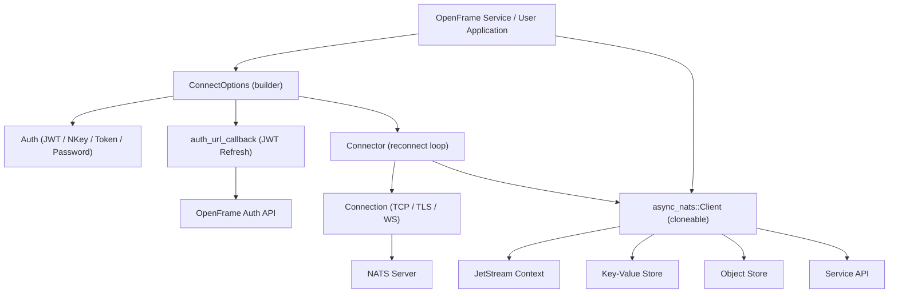

# Introduction to nats.rs

Welcome to **nats.rs** — the Flamingo-maintained Rust async client for the [NATS.io](https://nats.io) messaging ecosystem.

## What Is nats.rs?

`nats.rs` is a Tokio-based asynchronous Rust client for the NATS messaging system, built and maintained by [Flamingo](https://flamingo.run). It is a fork of the official NATS Rust client, extended with OpenFrame-specific capabilities — most notably a **JWT token refresh callback mechanism** that enables seamless, uninterrupted connectivity with OpenFrame authentication services.

NATS.io is a simple, secure, and high-performance open-source messaging system designed for cloud-native applications, IoT messaging, and microservices architectures. The `async-nats` crate in this repository exposes the full power of that ecosystem through an idiomatic, async-first Rust API.

## Key Features

| Feature | Description |
|---|---|
| **Core Pub/Sub** | High-throughput publish and subscribe over NATS subjects with wildcard matching |
| **Request / Reply** | Built-in request–reply pattern with configurable timeouts and inbox subjects |
| **JetStream** | Persistent messaging with at-least-once and exactly-once delivery semantics |
| **Key-Value Store** | NATS-backed KV store with history tracking, TTL, and per-key revision |
| **Object Store** | Large binary object storage with chunked upload/download and SHA-256 integrity |
| **Service API** | Micro-service framework with discovery (`$SRV.PING`), stats, and lifecycle management |
| **TLS / mTLS** | Full mutual TLS support via `rustls`, including TLS-first and native cert store modes |
| **Authentication** | JWT, NKey, token, username/password, and async auth callbacks |
| **OpenFrame JWT Refresh** | Flamingo extension: automatic JWT rotation via `auth_url_callback` on auth violations |
| **WebSocket** | Connections over WebSocket in addition to TCP |

## Target Audience

This library is designed for:

- **OpenFrame / Flamingo service developers** building microservices that communicate over NATS within the OpenFrame platform
- **Rust developers** who need an async NATS client with full JetStream, KV, and Object Store support
- **Platform engineers** operating NATS clusters and building tooling that interacts with the NATS API

## High-Level Architecture

## Repository Layout

The repository contains two main crates:

- **`async-nats/`** — The primary async client crate (Tokio-based). This is the crate you will use for all new development.
- **`nats/`** — The legacy synchronous client (deprecated, no longer actively maintained).

All documentation and tutorials in this guide focus on the `async-nats` crate.

## Getting Started

- See the [Prerequisites](prerequisites.md) guide to set up your development environment.
- Jump straight to the [Quick Start](quick-start.md) to connect and publish your first message in under five minutes.
- Follow the [First Steps](first-steps.md) guide to explore JetStream, KV, and the Service API.

## Community

Flamingo does not use GitHub Issues or GitHub Discussions. All community support and questions are handled on the **OpenMSP Slack**:

> Join the community at [https://www.openmsp.ai/](https://www.openmsp.ai/)

## Licence

`nats.rs` is licensed under the Apache License 2.0. See the repository at [https://github.com/flamingo-stack/nats.rs](https://github.com/flamingo-stack/nats.rs) for full details.
