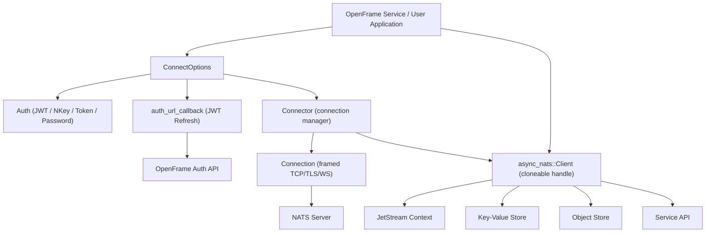
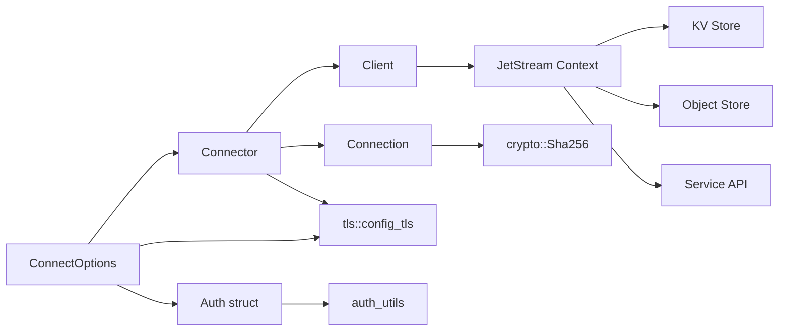
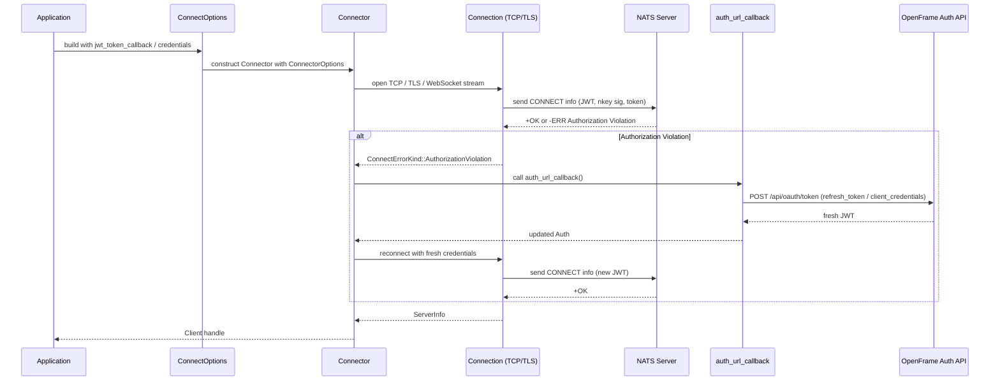
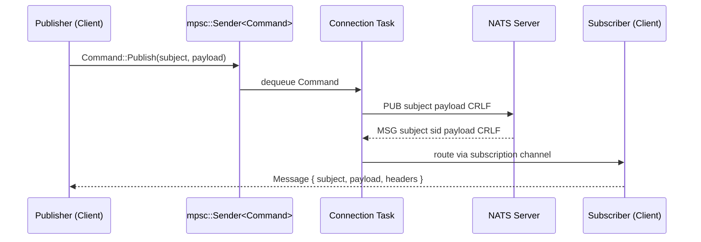

# nats.rs Module Documentation

# nats.rs — Architecture Documentation

> Rust async client for the NATS messaging system, enhanced with OpenFrame JWT token refresh integration.

---

## Overview

`nats.rs` is a Flamingo-maintained fork of the official NATS Rust client, providing a Tokio-based async client (`async-nats`) for the NATS messaging system. It supports Core NATS pub/sub, JetStream persistent messaging, Key-Value Store, Object Store, and the Service API. The fork extends the upstream library with an OpenFrame-specific JWT token refresh callback mechanism, enabling seamless, uninterrupted connectivity with OpenFrame authentication services.

---

## Architecture

### High-Level System Design



---

## Core Components

| Module / File | Location | Responsibility |
|---|---|---|
| `ConnectOptions` | `src/options.rs` | Builder for all connection configuration: TLS, auth, callbacks, timeouts, retry |
| `Client` | `src/client.rs` | Cloneable handle for pub/sub/request; wraps channels to connection task |
| `Connector` | `src/connector.rs` | Manages server list, reconnect loop, auth error handling, calls auth callbacks |
| `Connection` | `src/connection.rs` | Framed async TCP/TLS/WebSocket I/O; reads/writes NATS protocol ops |
| `Auth` | `src/auth.rs` | Holds credential material: JWT, nkey, signature callback, username/password, token |
| `auth_utils` | `src/auth_utils.rs` | Parses `.creds` files for JWT and nkey seeds |
| `tls` | `src/tls.rs` | Builds `rustls::ClientConfig` from cert/key paths or user-supplied config |
| `Message` | `src/message.rs` | Core NATS message struct (subject, reply, payload, headers, status) |
| `Subject` | `src/subject.rs` | UTF-8–validated immutable subject string type |
| `HeaderMap` | `src/header.rs` | NATS message headers (insert, append, get, iterate) |
| `StatusCode` | `src/status.rs` | NATS numeric status codes (100–999) with semantic helpers |
| `Error<Kind>` | `src/error.rs` | Generic typed error with optional source chaining |
| `crypto` | `src/crypto.rs` | SHA-256 abstraction over `ring` or `aws-lc-rs` |
| `jetstream/` | `src/jetstream/` | JetStream context, streams, consumers (push/pull/ordered), KV, Object Store, Service API |

---

## Component Relationships



---

## Data Flow

### Connection Establishment & Token Refresh



### Publish / Subscribe Message Flow



---

## Key Files

| File | Purpose |
|---|---|
| [`async-nats/src/lib.rs`](https://github.com/flamingo-stack/nats.rs/blob/main/async-nats/src/lib.rs) | Crate root; re-exports public API, `connect()` shorthand, module declarations |
| [`async-nats/src/options.rs`](https://github.com/flamingo-stack/nats.rs/blob/main/async-nats/src/options.rs) | `ConnectOptions` builder — all user-facing connection configuration including `auth_url_callback` |
| [`async-nats/src/connector.rs`](https://github.com/flamingo-stack/nats.rs/blob/main/async-nats/src/connector.rs) | Reconnection loop, server rotation, auth error recovery, `handle_auth_error` invoking JWT refresh |
| [`async-nats/src/client.rs`](https://github.com/flamingo-stack/nats.rs/blob/main/async-nats/src/client.rs) | `Client` struct — `publish`, `subscribe`, `request`, `flush`, `force_reconnect`; trait impls |
| [`async-nats/src/connection.rs`](https://github.com/flamingo-stack/nats.rs/blob/main/async-nats/src/connection.rs) | `Connection` — framed vectored I/O, NATS protocol parser (`try_read_op`, `enqueue_write_op`) |
| [`async-nats/src/auth.rs`](https://github.com/flamingo-stack/nats.rs/blob/main/async-nats/src/auth.rs) | `Auth` struct holding all credential material passed into `ConnectInfo` |
| [`async-nats/src/auth_utils.rs`](https://github.com/flamingo-stack/nats.rs/blob/main/async-nats/src/auth_utils.rs) | `.creds` file loader; regex-based JWT and nkey seed parser |
| [`async-nats/src/tls.rs`](https://github.com/flamingo-stack/nats.rs/blob/main/async-nats/src/tls.rs) | `config_tls()` — native cert loading, user cert/key loading, `rustls::ClientConfig` construction |
| [`async-nats/src/message.rs`](https://github.com/flamingo-stack/nats.rs/blob/main/async-nats/src/message.rs) | `Message` — the fundamental unit of NATS communication |
| [`async-nats/src/header.rs`](https://github.com/flamingo-stack/nats.rs/blob/main/async-nats/src/header.rs) | `HeaderMap`, `HeaderName`, `HeaderValue` — NATS message headers |
| [`async-nats/src/error.rs`](https://github.com/flamingo-stack/nats.rs/blob/main/async-nats/src/error.rs) | Generic `Error<Kind>` type used throughout the crate |
| [`async-nats/tests/jwt_tests.rs`](https://github.com/flamingo-stack/nats.rs/blob/main/async-nats/tests/jwt_tests.rs) | Integration tests for JWT/credentials auth and reconnect behaviour |
| [`async-nats/tests/client_tests.rs`](https://github.com/flamingo-stack/nats.rs/blob/main/async-nats/tests/client_tests.rs) | Integration tests for pub/sub, queue groups, force reconnect |

---

## Dependencies

The `async-nats` crate relies on the following key library dependencies:

| Dependency | Role in this project |
|---|---|
| `tokio` | Async runtime; all I/O, timers, channels, and task spawning |
| `tokio-rustls` / `rustls` | TLS 1.3 connection wrapping over `TcpStream`; `ClientConfig` construction |
| `rustls-native-certs` | Loads OS trust store into `RootCertStore` when no explicit CA is given |
| `rustls-pemfile` | Parses PEM-encoded certs and private keys for client auth |
| `rustls-webpki` | Certificate verification and trust anchor extraction |
| `bytes` | Zero-copy `Bytes` / `BytesMut` for read/write buffers and message payloads |
| `futures-util` | `StreamExt`, `SinkExt`, `TryFutureExt` — async stream combinators on `Subscriber` |
| `tokio-util` | `PollSender<Command>` for `Sink`-based back-pressure on the command channel |
| `nkeys` | nkey `KeyPair` for Ed25519 challenge signing during NATS authentication |
| `ring` / `aws-lc-rs` | SHA-256 digest (feature-gated); used for Object Store chunk integrity |
| `base64` | URL-safe base64 encoding of nkey signatures and JWTs in `ConnectInfo` |
| `rand` | Server list shuffling (`SliceRandom`) during reconnect |
| `regex` / `once_cell` | Parsing NATS server version strings and `.creds` file format |
| `serde` / `serde_json` | Serialising `ConnectInfo`, `ServerInfo`, JetStream API JSON payloads |
| `memchr` | Fast `\r\n` search in the read buffer inside `Connection::try_read_op` |
| `thiserror` | Derive macros for typed error kinds (`PublishErrorKind`, etc.) |
| `tracing` | Structured async-aware logging throughout connection and protocol layers |
| `portable-atomic` | `AtomicU64` for subscription ID generation on platforms without native 64-bit atomics |
| `time` | `OffsetDateTime` used in JetStream stream/consumer configurations |

---

## OpenFrame-Specific Extension

The key Flamingo addition over upstream `nats.rs` is the `auth_url_callback` field on `ConnectOptions` and the corresponding recovery path inside `Connector::connect`:

```text
ConnectErrorKind::AuthorizationViolation
  └─► Connector::handle_auth_error()
        └─► calls options.auth_url_callback (async fn() -> Result<String, AuthError>)
              └─► fetches fresh JWT from OpenFrame Auth API
                    └─► updates options.auth.jwt
                          └─► retries connection loop
```

This is transparent to application code — the client simply reconnects with fresh credentials without surfacing the interruption to subscribers or publishers.

---

## Development Reference

```bash
# Clone
git clone https://github.com/flamingo-stack/nats.rs.git
cd nats.rs

# Build all crates
cargo build --all

# Run all tests (requires a local NATS server)
cargo test --all

# Lint and format
cargo fmt --all
cargo clippy --all

# Run OpenFrame integration tests
cargo test --test openframe_integration

# Run benchmarks
cargo bench --package async-nats
```

**Feature flags** (in `async-nats/Cargo.toml`):

| Flag | Effect |
|---|---|
| `ring` (default) | Use `ring` crate for SHA-256 crypto |
| `aws-lc-rs` | Use AWS LC for SHA-256 (FIPS-compatible alternative) |
| `websockets` | Enable WebSocket transport via `tokio-websockets` |
| `server_2_10` | Enable NATS Server 2.10+ features (consumer limits, etc.) |
| `server_2_11` | Enable NATS Server 2.11+ features (priority policy, batch config) |
| `service` | Enable the NATS Service API |
| `compatibility_tests` | Enable cross-client compatibility test suite |
