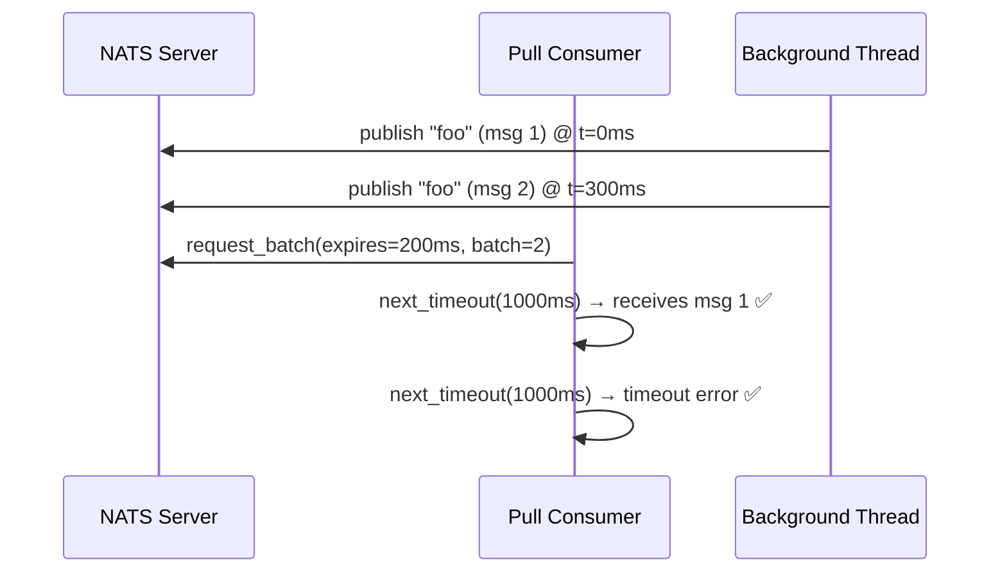

<!-- source-hash: b8c8a57d925cf63b2f4726aacfc9c4b6 -->
A test that verifies JetStream pull consumer behavior when a batch request expires before all messages are delivered.

## Key Components

- **`request_timeout` test** — Integration test validating that a `BatchOptions` expiration causes the second message in a batch to time out when it arrives after the expiry window.

## Test Flow



## Usage Example

```rust
// Request a batch with a short expiration window
consumer
    .request_batch(BatchOptions {
        expires: Some(Duration::from_millis(200).as_nanos() as usize),
        batch: 2,
        no_wait: false,
    })
    .unwrap();

// First message arrives within the window — succeeds
let msg = consumer.next_timeout(Duration::from_millis(1000)).unwrap();
msg.ack().unwrap();

// Second message arrives after expiry — errors as expected
let _ = consumer
    .next_timeout(Duration::from_millis(1000))
    .expect_err("should timeout");
```

The `expires` field uses nanoseconds cast from a `Duration`, and the batch request is considered expired by the server once that window elapses — even if not all messages have been consumed. See the full test suite at [`tests/`](https://github.com/flamingo-stack/nats.rs/blob/main/tests/).